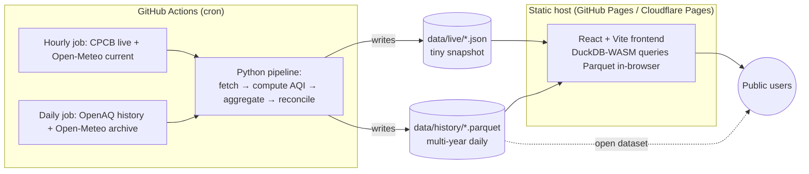

# India Air Quality + Weather Dashboard — Build Plan

**Status:** Sources locked. Ready to build with Claude Code.
**Last updated:** 2026-06-07

A free, open-source, public dashboard for Indian cities showing air quality (AQI) and
weather, with multi-year seasonal trends, severity at a glance, pollution-vs-weather
correlation, and city-to-city comparison. Default AQI standard is India's NAQI, with a
user toggle to US EPA AQI and EU EAQI — all computed from raw pollutant concentrations.

---

## 1. Goals & non-goals

**Goals**
- Audience: Indian public and policy users. India-only scope.
- Show: live AQI headline, **individual pollutants** (PM2.5, PM10, NO2, SO2, O3, CO),
  multi-year/seasonal trends, **exceedance metrics** (days/year above AQI thresholds), weather,
  AQI↔weather correlation, and comparison **between Indian cities** (and across years).
- Standards: NAQI (default) + US EPA AQI + EU EAQI, toggleable. Always show the raw concentration alongside the index.
- Fully open: open-source code, open data, free hosting, low long-term maintenance.
- Trends must be populated **on launch day** (requires backfilled history).

**Non-goals (for v1)**
- Global / cross-country comparison (dropped — India-only).
- Forecasting future AQI.
- User accounts, alerts, or personalization.

---

## 2. Locked data sources

| Layer | Source | Role | Auth | Licence/attribution |
|---|---|---|---|---|
| Live AQI (today) | **CPCB via data.gov.in** ("Real time Air Quality Index from various locations") | Official current headline; raw per-pollutant concentrations | Free API key | Govt of India / CPCB — attribute |
| Historical AQI (multi-year) | **OpenAQ** (API + AWS S3 open-data archive) | Backfilled multi-year trends; same CPCB stations underneath | Free API key | CC BY; comply with upstream terms — attribute |
| Weather (current + historical) | **Open-Meteo** (Forecast API + Archive/ERA5 API, history to 1940) | Temp, humidity, rainfall, wind — current and multi-year | None | CC BY 4.0 — attribute |

**Why this split:** CPCB is the authoritative live number Indian users trust, but its feed is a
*snapshot with no memory*. OpenAQ re-ingests CPCB's Indian stations and keeps multi-year
history with ready aggregations, so trend charts work at launch. Open-Meteo's archive covers
weather history with no key.

**Source reconciliation (important for a policy audience):** the live CPCB value and OpenAQ's
value for the same hour may not match to the decimal. To avoid a visible contradiction:
- **Today** → CPCB.
- **Up to and including yesterday** → OpenAQ.
- Label the source on every view; render the today/history seam cleanly (no overlap).

**Coverage caveat to validate during build:** OpenAQ's depth/completeness varies by station.
Before finalizing the city list, validate that each target city actually has usable multi-year
data; flag thin cities rather than showing broken charts.

---

## 3. Architecture

Static site + scheduled data pipeline. No always-on server — the cheapest and most
maintainable shape, and everything is version-controlled.



**Two-tier data resolution** (keeps everything small enough to live in the repo and query in
the browser — no database server, free hosting):
- **History (multi-year):** daily-aggregated Parquet per city. Years of daily data for a few
  hundred cities is only a few MB as Parquet.
- **Recent (last ~90 days):** hourly Parquet, for fine-grained recent trends and the
  AQI↔weather overlay.
- **Live (today):** small JSON snapshot, refreshed hourly.

The published Parquet files **are** the open dataset — anyone can download or query them.

---

## 4. Recommended tech stack

Chosen for: open-source, free to host, low maintenance, and fluent for Claude Code to build.

**Data pipeline (Python)**
- `httpx` (HTTP), `polars` or `pandas` (transform), `pyarrow` (Parquet).
- Pure-Python `aqi/` module implementing the three standards (see §6). Fully unit-tested.
- `duckdb` (Python) for aggregation queries during the build step (optional but tidy).

**Storage / data layer**
- **Parquet files in the repo** under `data/` (use Git LFS only if total exceeds ~50 MB).
- **DuckDB-WASM** in the frontend to query Parquet client-side — zero backend.
- *Optional extra:* publish a **Datasette** instance (open source) for a hosted SQL explorer +
  JSON API over the data, if you want a richer "open data" front door later. Not required for v1.

**Frontend (static)**
- **React + Vite + TypeScript** — Claude Code's strongest area; full control over the
  standard toggle, city comparison, and weather-overlay interactions.
- **Apache ECharts** — time-series trends, dual-axis AQI↔weather, multi-city comparison.
- **Leaflet** + an open India GeoJSON — city map with AQI-coloured markers.
- **Tailwind CSS** — styling.
- **DuckDB-WASM** — in-browser Parquet querying.

**Hosting & automation**
- **GitHub Pages** (simplest, repo-native, free) — or **Cloudflare Pages** for better
  performance (also free). Either serves the site + data files.
- **GitHub Actions** cron for the pipeline — free for public repos, nothing to babysit.

**Lower-code alternative (optional):** if you later want less custom UI, **Observable Framework**
or **Evidence.dev** are open-source static dashboard generators (both lean on DuckDB) that
trade flexibility for speed. Recommended primary remains React+Vite for the interactions above.

---

## 5. Repository structure

```
india-aqi-weather/
├── README.md                  # what it is, live link, methodology summary, attribution
├── LICENSE                    # MIT or Apache-2.0 (code)
├── LICENSE-DATA               # CC BY 4.0 (published data) + attribution block
├── SOURCES.md                 # source URLs, terms, refresh cadence, data dictionary
├── pipeline/
│   ├── pyproject.toml
│   ├── aqi/                   # standards engine (see §6) + tests
│   │   ├── breakpoints.py     # the three breakpoint tables
│   │   ├── compute.py         # sub-index, aggregation, conversion
│   │   └── test_compute.py    # includes the §7 regression case
│   ├── ingest/
│   │   ├── cpcb.py            # data.gov.in live fetch
│   │   ├── openaq.py          # OpenAQ history fetch (API + S3 archive)
│   │   └── openmeteo.py       # current + archive weather
│   ├── transform/
│   │   ├── aggregate.py       # station→city, hourly→daily
│   │   └── reconcile.py       # today=CPCB, history=OpenAQ seam
│   └── run.py                 # orchestrates a full refresh (idempotent)
├── data/
│   ├── live/                  # current snapshot JSON (hourly)
│   ├── history/               # multi-year daily Parquet
│   ├── recent/                # last ~90 days hourly Parquet
│   └── meta/                  # city list, station map, coverage report
├── web/                       # Vite + React + TS app
│   ├── src/
│   │   ├── lib/duckdb.ts      # load + query Parquet
│   │   ├── lib/standards.ts   # category/colour mapping per standard
│   │   ├── components/        # Map, Headline, TrendChart, WeatherOverlay, CompareCities, StandardToggle
│   │   └── pages/             # Dashboard, Methodology/About
│   └── ...
└── .github/workflows/
    ├── refresh-hourly.yml     # live + current weather
    └── refresh-daily.yml      # history backfill/delta + rebuild + deploy
```

---

## 6. AQI computation module (the core logic)

**Principle:** AQI is a *formula*, not a measurement. Store raw concentrations; compute any
standard on demand. Each standard = (a) per-pollutant piecewise-linear sub-index from its
breakpoint table, then (b) overall index = max of sub-indices (with rules below).

**Sub-index formula (piecewise linear):**
`I = (I_hi − I_lo) / (BP_hi − BP_lo) × (C − BP_lo) + I_lo`
where `C` is truncated to the standard's stated precision before lookup.

**Per-standard rules**
- **India NAQI:** 8 pollutants (PM2.5, PM10, NO2, SO2, CO, O3, NH3, Pb); concentrations in
  µg/m³ (CO in mg/m³). Overall = max sub-index. Requires **≥3 pollutants present, one of which
  is PM2.5 or PM10**. *City AQI* = require **≥3 stations**, then **average** each pollutant's
  sub-index across stations (note: average, not max) before taking the max across pollutants.
- **US EPA AQI:** 6 pollutants (PM2.5, PM10, O3, NO2, SO2, CO). Gaseous pollutants use **ppb/ppm
  and short averaging windows** (NO2 & SO2 are 1-hour; CO & O3 8-hour). PM uses 24-hour
  (NowCast for live). **Convert µg/m³ → ppb** for gases before lookup. Overall = max sub-index.
- **EU EAQI:** 5 pollutants (PM2.5, PM10, NO2, O3, SO2), all µg/m³, **hourly**. Output is a
  **6-band category** (good / fair / moderate / poor / very poor / extremely poor), **not** a
  0–500 number — overall = worst band among pollutants. Surface as category + colour.

**Averaging windows differ — do not feed one stored value into all three blindly.** Keep
hourly raw data and derive each standard's required window.

### India NAQI breakpoints (verified — CPCB 2014)

| Category (Index) | PM10 24h | PM2.5 24h | NO2 24h | SO2 24h | NH3 24h | O3 8h | CO 8h (mg/m³) |
|---|---|---|---|---|---|---|---|
| Good (0–50) | 0–50 | 0–30 | 0–40 | 0–40 | 0–200 | 0–50 | 0–1.0 |
| Satisfactory (51–100) | 51–100 | 31–60 | 41–80 | 41–80 | 201–400 | 51–100 | 1.1–2.0 |
| Moderate (101–200) | 101–250 | 61–90 | 81–180 | 81–380 | 401–800 | 101–168 | 2.1–10 |
| Poor (201–300) | 251–350 | 91–120 | 181–280 | 381–800 | 801–1200 | 169–208 | 10.1–17 |
| Very Poor (301–400) | 351–430 | 121–250 | 281–400 | 801–1600 | 1201–1800 | 209–748 | 17.1–34 |
| Severe (401–500) | 430+ | 250+ | 400+ | 1600+ | 1800+ | 748+ | 34+ |

### US EPA PM2.5 breakpoints (verified — effective May 6, 2024)

| Category (Index) | PM2.5 24h (µg/m³) |
|---|---|
| Good (0–50) | 0.0–9.0 |
| Moderate (51–100) | 9.1–35.4 |
| USG (101–150) | 35.5–55.4 |
| Unhealthy (151–200) | 55.5–125.4 |
| Very Unhealthy (201–300) | 125.5–225.4 |
| Hazardous (301–500) | 225.5–325.4 |

US PM10 (24h, µg/m³): 0–54 / 55–154 / 155–254 / 255–354 / 355–424 / 425–604.
**For the remaining US tables (O3, CO 8h; NO2, SO2 1h in ppb) encode directly from the
authoritative source — do not transcribe from memory:** EPA AQS breakpoints code table
(`aqs.epa.gov/aqsweb/documents/codetables/aqi_breakpoints.html`) and the May 2024 AQI Technical
Assistance Document (airnow.gov). At AQI 500: PM2.5=325.4, PM10=604, CO=50.4 ppm, SO2=1004 ppb.

### EU EAQI bands

Six bands per pollutant (PM2.5, PM10, NO2, O3, SO2), hourly, overall = worst band. **The EEA
revised the band thresholds in 2024** — encode current numeric bands from the EEA source
(`airindex.eea.europa.eu`) rather than older published tables, and pin the version in `SOURCES.md`.

---

## 7. Regression test (lock this into `test_compute.py`)

Same 24-hour concentrations, three standards — verifies the engine and the "different label for
identical air" behaviour:

**Input:** PM2.5 = 90, PM10 = 250, NO2 = 80, SO2 = 40 µg/m³

| | Expected overall | Dominant |
|---|---|---|
| India NAQI | **200 — "Moderate"** | PM2.5 / PM10 |
| US EPA AQI | **≈175 — "Unhealthy"** | PM2.5 |
| EU EAQI | **"Extremely Poor"** | PM2.5 / PM10 |

(India PM2.5 sub-index at 90 = 200; US PM2.5 at 90 ≈ 175 via the 55.5–125.4 → 151–200 segment;
EU PM2.5 at 90 is the worst band. Identical air reads as "Moderate" in India yet "Unhealthy" in
the US — by design, because India's Moderate band is wider.)

---

## 8. Frontend widgets

1. **City selector + map** — Leaflet map of India, markers coloured by current AQI category.
2. **AQI headline** — big current number/category for the selected city, with the **standard
   toggle** (NAQI / US / EU) and the raw dominant-pollutant concentration shown beneath. Shows a
   **"last updated" timestamp**, and a **staleness banner** if today's live data is older than N hours.
3. **Per-pollutant view** — lets the user see **individual pollutants**, not just the composite.
   Covers the key pollutants that drive the indices: **PM2.5, PM10, NO2, SO2, O3, CO** (these are
   already stored as raw concentrations). Two parts: (a) current per-pollutant concentrations +
   each pollutant's sub-index for the active standard, with the dominant one flagged; (b) a
   per-pollutant trend chart so a user can chart, say, PM2.5 vs PM10 over time. Values shown in the
   source unit (µg/m³; CO in mg/m³).
4. **Multi-year trend chart** — daily AQI over time (ECharts), with category colour bands and a
   range selector (90d / 1y / all). Visibly marks the today(CPCB)/history(OpenAQ) seam.
5. **Exceedance analytics** — policy-style "how many bad days" metrics computed from the daily
   history (DuckDB-WASM, client-side):
   - Per city, per year: **count of days where daily AQI exceeds a threshold**. Thresholds are
     **standard-aware** — default set {50, 100, 200} (and the upper NAQI boundaries 300/400 when
     NAQI is active), since "days above 100" means different air under different standards.
   - **Across cities:** bar chart ranking cities by exceedance days for a chosen year + threshold.
   - **Across years:** per-city year-over-year exceedance-day trend, to show improvement/worsening.
   - Daily AQI is computed per standard from the 24h-aggregated concentrations (consistent with the
     engine in §6), so these counts always match the active standard toggle.
6. **AQI ↔ weather overlay** — dual-axis: AQI vs temperature/humidity/rainfall, recent window.
7. **Compare cities** — multiple Indian cities on one normalized AQI axis.
8. **Methodology / About / Sources** — explains the three standards, the formula-not-measurement
   point, source reconciliation, coverage caveats, exceedance-count methodology, and attribution.

**Accessibility:** use colour-blind-safe category palettes (e.g. EPA's "ColorVision Assist"
variant); never rely on colour alone — always pair with the category label.

---

## 9. Automation & maintenance

- **Hourly workflow:** fetch CPCB live + Open-Meteo current → update `data/live/` → commit/deploy.
- **Daily workflow:** pull OpenAQ deltas + Open-Meteo archive deltas → update `data/history/` &
  `data/recent/` → rebuild → deploy.
- **Idempotent & self-healing:** re-running a job reproduces the same outputs; gaps backfill on
  the next run.
- **Resilience (decoupled uptime):** the **site never calls upstream sources at request time** —
  it serves our own stored Parquet/JSON. So if CPCB/OpenAQ/Open-Meteo is down, the site stays up
  and shows the last good data; history/trends are unaffected; only today's live headline goes
  stale (surfaced via the "last updated" timestamp + staleness banner). The pipeline keeps the
  **last good snapshot** rather than overwriting it with an empty/failed fetch.
- **Failure alerting:** on workflow failure or stale data (e.g. live snapshot older than N hours),
  auto-open a GitHub Issue. Keeps maintenance near-zero and visible.
- **Low-touch upkeep:** the main recurring risks are (a) an upstream schema change at CPCB/OpenAQ
  and (b) a standard's breakpoints being revised. Both are isolated to small modules
  (`ingest/*`, `aqi/breakpoints.py`) with tests, so fixes are contained.

---

## 10. Licensing & making it public

- **Code:** MIT or Apache-2.0.
- **Published data:** CC BY 4.0 + an attribution block crediting **CPCB / data.gov.in**,
  **OpenAQ**, and **Open-Meteo** (Open-Meteo and OpenAQ both require attribution; CPCB is Govt of
  India data — attribute). Put this in `LICENSE-DATA`, `SOURCES.md`, and the About page.
- **Transparency for trust (policy audience):** publish the methodology, the exact breakpoint
  versions in use, and the today/history source seam. Ship a `data dictionary` describing every
  column and unit.

---

## 11. Build phases (suggested order for Claude Code)

1. **Scaffold** — repo, licences, `SOURCES.md`, CI skeleton, empty module layout.
2. **AQI engine** — `aqi/` with all three standards + `test_compute.py` (the §7 case green).
3. **Ingestion** — `cpcb.py`, `openaq.py`, `openmeteo.py`; cache responses; respect each
   standard's averaging windows.
4. **Transform** — station→city aggregation (NAQI city rule), hourly→daily, reconciliation seam.
5. **Storage** — write two-tier Parquet + live JSON; generate the coverage report.
6. **Automation** — the two GitHub Actions workflows + failure-alerting.
7. **Frontend scaffold** — Vite/React/TS/Tailwind + DuckDB-WASM Parquet loading.
8. **Widgets** — in order: standard toggle + headline → map → per-pollutant view → trend chart →
   exceedance analytics → weather overlay → compare cities → methodology page.
9. **Polish** — accessibility, mobile, About/Sources.
10. **Deploy** — GitHub Pages (or Cloudflare Pages) + verify scheduled refresh end-to-end.

---

## 12. Open items to validate during build (not blockers)

- Final **city list** — driven by OpenAQ coverage validation (§2 caveat).
- Whether to keep **hourly history beyond 90 days** for any flagship city (size vs. value).
- Whether to add **Datasette** as a hosted open-data explorer (nice-to-have, post-v1).
- Confirm current **EU EAQI band numbers** and **full US gas breakpoint tables** from the cited
  authoritative sources at implementation time, and pin versions in `SOURCES.md`.
